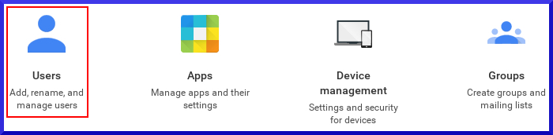
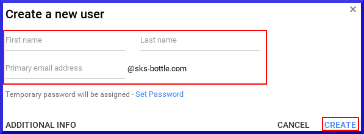
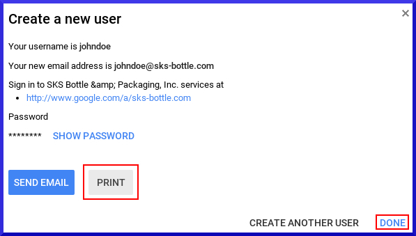

# SK591 - How to Setup a New Gmail Account
## Purpose - Create an SKS email account for new employees
## Procedure
Sign into the Administrator panel: https://admin.google.com

On the Administrator Console, select **Users**

\

Left hand column: Select the proper sub-organization for the user

\

\pagebreak

Bottom right hand corner: Click the **Add** button

\

The following form will be presented

\

Print out the user credentials

\
