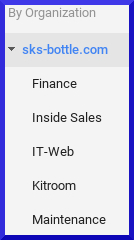

# SK591 - How to Setup a New Gmail Account
## Purpose - Ensure an employee can send and receive messages worldwide
## Procedure
Visit https://admin.google.com and sign in with an Administrator SKS Gmail account

On the Admin Console, select **Users**

Left hand column: Select the proper sub-organization for the user

\pagebreak

Bottom right hand corner: Click the **Add** button

The following form will be presented

Print out the user credentials

\
