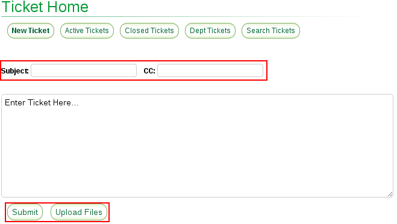

% SK596 - Using the IT Ticket System
% 2015-08-18
% Jeffrey Wen

## Purpose: Properly submit a ticket to the Web and IT department for review and resolution
___
Log into SKS-Connect and click on the **Ticket Icon** on the top menu

* **Subject** - The gist of your issue/request  
* **CC** - Carbon copy other user(s) by typing in his/her name or email  
* Upload any pertinent images that may help resolve your request

