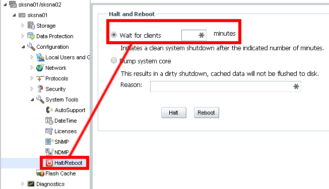

# SKXXX - Planned Power Outage
## Purpose - Properly shutdown server room equipment
## Procedure

## VMware vSphere Client
Launch the VMware vSphere Client and enable SSH on ESXi01 and ESXi02


\pagebreak


## Power Off
### Virtual Machines
There are two options to turning off guest VMs

1. Use the vSphere client [ **DO NOT USE THIS - UNGRACEFUL SHUTDOWN** ]
	* Right-click each virtual machine and Power Off
2. SSH into each VM

|Server|IP Address|Procedure|
|:-|:-|:-|
|AlienVault Server|192.168.1.229|Option 7 - Shutdown Appliance|
|AlienVault Sensor|192.168.1.230|Option 7 - Shutdown Appliance|
|Chef Server|192.186.4.3|`telinit 0`|
|Chef Workstation|192.168.4.2|`telinit 0`|
|SKS-Bottle Slave|192.168.4.21|`mysqladmin -u root -p stop-slave; telinit 0`|
|SKS-Connect Slave|192.168.4.20|`mysqladmin -u root -p stop-slave; telinit 0`|
|SKS-Science Slave|192.168.4.22|`mysqladmin -u root -p stop-slave; telinit 0`|
|Development Web Connect|192.168.4.100|`telinit 0`|
|Development DB Connect|192.168.4.101|`telinit 0`|
|Live Web Connect|10.2.2.3|`telinit 0`|
|Live DB Connect|10.2.2.4|`telinit 0`|
|Local Environments|192.168.4.X|`telinit 0`|
|Development ConnectShip|192.168.1.86|Windows Shutdown|
|Production ConnectShip|192.168.1.21|Windows Shutdown|
|Nagios Server|192.168.4.30|`telinit 0`|
|SSH Server|192.168.4.50|`telinit 0`|
|Production PolyPro|192.168.4.220|`telinit 0`|
|SKSDC01|192.168.1.224|`vim-cmd vmsvc/power.shutdown vID`|
|SKSDC02|192.168.1.7|`vim-cmd vmsvc/power.shutdown vID`|
|SKSVC01|192.168.223|`vim-cmd vmsvc/power.shutdown vID`|
|webdept|192.168.1.4|Windows Shutdown|
|Cisco Prime|192.168.1.240|`halt`|

### ESXi Hosts
Once all of the guest VMs are turned off, only then, can the ESXI host can shut down

1. SSH into ESXi01/02

	* ESXi01 - 10.1.1.223
	* ESXi02 - 10.1.1.224

2. On both of the ESXi servers, bring them into Maintenance Mode, Shutdown delay, and Exit Maintenance Mode
```bash
esxcli system maintenanceMode set -e true -t 0
esxcli system shutdown poweroff -d 10 -r "Shell initiated system shutdown"
esxcli system maintenanceMode set -e false -t 0
```

### NetApp Storage
\pagebreak
Enter 5 minutes to initiate a clean system halt



Once the NetApp has come to a halt, flip the power switches on the back of the NetApp

### Firewall/Switches
Unplug the Switches

Unplug the Firewall

## Power On
The procedure would be the opposite 

## Common Issues
When all of the equipment is powered on, there may be no Internet access. This is related to duplicate VMs on both of the ESXI hosts. In order to resolve this issue, it would require a Windows computer with the vSphere client.

Log into vSphere with **one** of the following credentials:
IP Address/Name: 10.1.1.223  
User name: root  
Password: \$k\$B0tt13  

IP Address/Name: 10.1.1.224  
User name: root  
Password: \$k\$B0tt13  

In the Summary Tab, it may ask a question that you will have to respond to

Turn on SKSDC01, SKSDC02, and SKSVC01 on **one** of the hosts

Once those are on, use the vSphere client to sign into SKSVC01:  
IP Address/Name: SKSVC01  
User name:  
Password:  
Check: Use Windows session credentials  

If signing in does not work, double check the IP address of SKSVC01  
