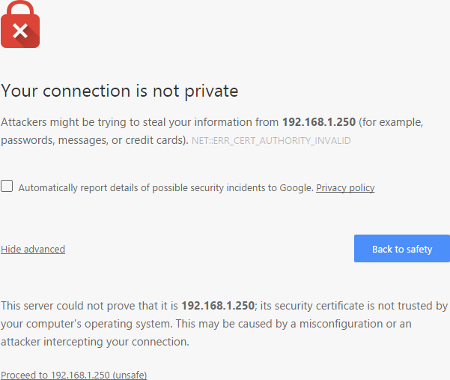
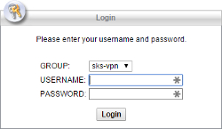
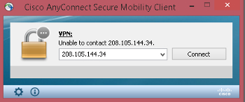

# SKXXX - How to Install Cisco AnyConnect
## Purpose - Securely establish a VPN to SKS Bottle & Packaging, Inc.
## Procedure

Since this procedure is written internally at SKS, anywhere it mentions the internal IP address 192.168.1.250, treat it as 208.105.144.34

Basically: 192.168.1.250 > 208.105.144.34

Head over to https://208.105.144.34 and proceed 

You will be presented with a login screen

Run through the installation with the java applet. If the java applet fails due to an incompatibility between your java version and the applet, download and install the Windows Desktop application that it will provide you.

When the installation is done, launch the **Cisco AnyConnect Secure Mobility Client** and connect to 208.105.144.34

